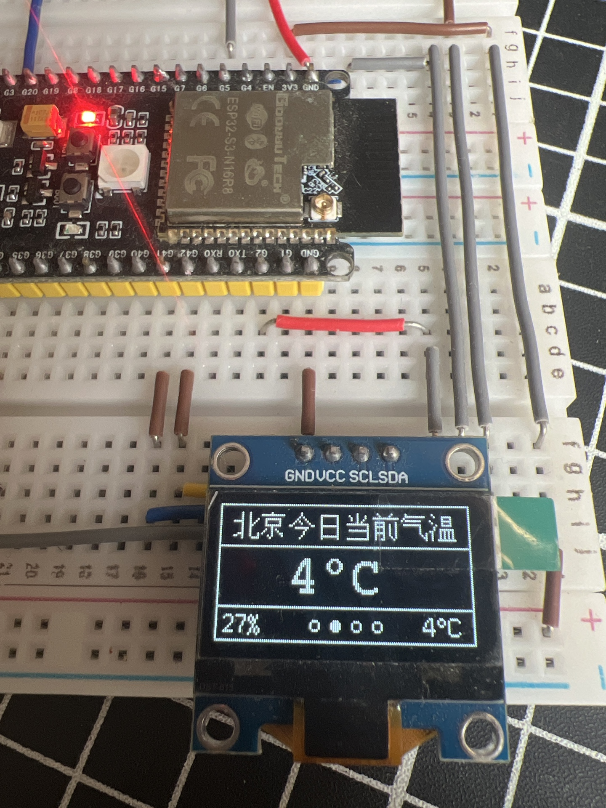
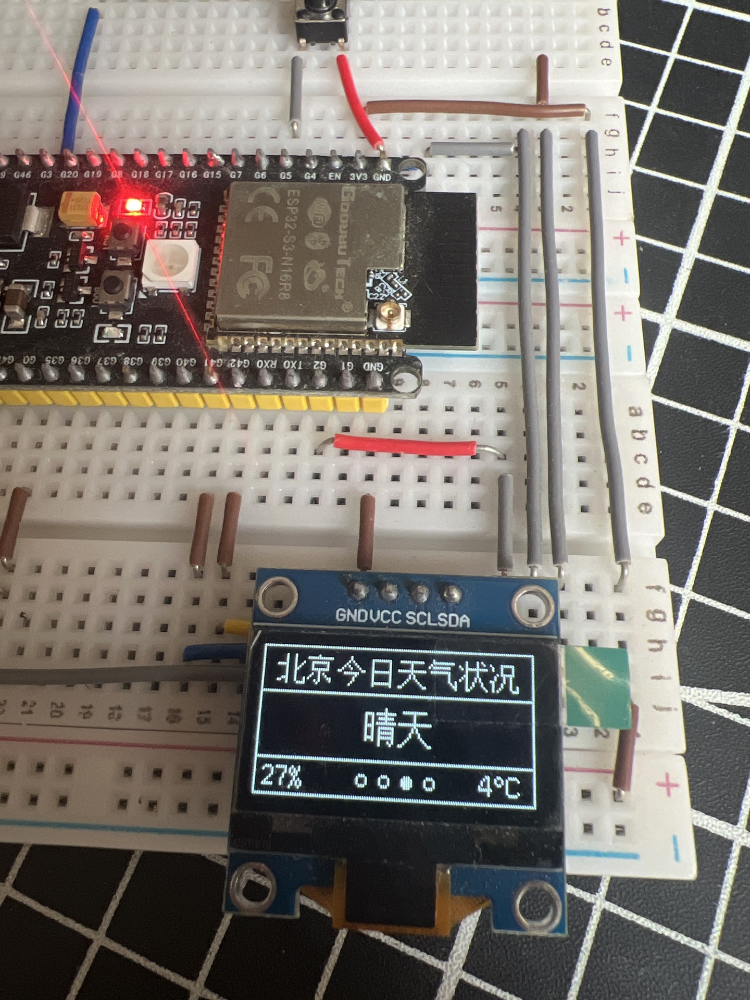
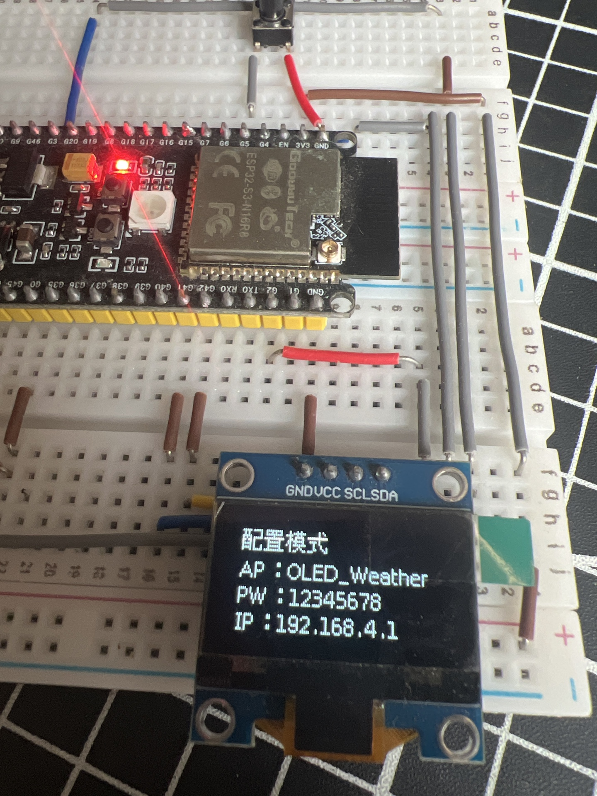

# OLED SSD1306 天气与时钟系统

## 项目介绍
这是一个基于 ESP32-S3 和 OLED SSD1306 显示屏的天气与时钟系统，能够显示实时时间、日期、天气状况、温度和湿度等信息。

## 功能特性
- 显示实时时间、日期和星期
- 显示当前城市天气状况（自适应居中显示）
- 显示当前温度和湿度
- 支持灵活配置 WiFi 和城市
- 支持通过按钮重新进入配置模式
- 采用 NTP 同步时间
- 优化的天气数据获取，减少 API 调用次数
- 优化的屏幕刷新频率，减少掉帧
- 按钮短按切换页面，长按3秒进入配置模式
- AP模式配置页面显示完整信息（AP名称、密码、IP地址）

## 硬件要求
- ESP32-S3 开发板
- OLED SSD1306 显示屏（128x64，I2C 接口）
- 按钮（连接到 GPIO 5）

## 引脚连接
- OLED 时钟引脚 (SCL) -> GPIO 42
- OLED 数据引脚 (SDA) -> GPIO 41
- 按钮 -> GPIO 5 (连接到 GND)

## 配置与使用

### 首次配置
1. 烧录代码到 ESP32-S3 开发板
2. 设备启动后会自动进入配置模式
3. 使用手机或电脑连接名为 `OLED_Weather` 的 WiFi 网络，密码为 `12345678`
4. 打开浏览器，访问 `http://192.168.4.1`
5. 在配置页面中输入您的 WiFi 名称、密码和要查询的城市名称
6. 点击"保存配置"按钮，设备将重启并连接到您的 WiFi 网络

### 重新配置
如果您需要更改 WiFi 网络或城市，可以通过以下方式重新进入配置模式：
1. 长按设备上的按钮约 3 秒
2. 设备会清除当前配置并自动重启
3. 设备重启后会重新进入配置模式，您可以按照首次配置的步骤进行重新配置

## 页面说明
设备显示屏分为四个页面，可以通过短按按钮切换：

### 1. 首页 - 日期时间
显示日期、时间、星期和当前天气信息

### 2. 第二页 - 当前气温
显示当前城市的气温

### 3. 第三页 - 天气状况
显示当前城市的天气状况

### 4. 第四页 - 设备IP
显示设备的 IP 地址

### 配置页面
设备进入配置模式时的OLED显示

## 技术实现
- 使用 U8g2 库驱动 OLED 显示屏
- 使用 WiFi 库连接网络
- 使用 NTP 协议同步时间
- 使用 wttr.in API 获取天气数据
- 使用 ArduinoJson 库解析 JSON 数据
- 使用 WebServer 库提供配置页面
- 使用 Preferences 库存储配置信息

## 更新日志
- Version 0.0.6：
  - 优化了按钮响应，实时检测按钮状态
  - 修复了单次按按钮切换页面不灵敏的问题
  - 将AP名称改为OLED_Weather
  - 优化了配置模式下的OLED显示，显示完整的AP信息
  - 实现了天气状况文字自适应居中显示
  - 修复了switch语句中的作用域问题
- Version 0.0.5：优化了屏幕刷新频率，减少掉帧；统一了天气数据获取逻辑，减少 API 调用次数

## 注意事项
- 设备需要连接到互联网才能获取天气数据和同步时间
- 天气数据每 10 分钟更新一次
- 设备重启后会自动连接到上次配置的 WiFi 网络
- 长按按钮 3 秒可以清除配置并重新进入配置模式